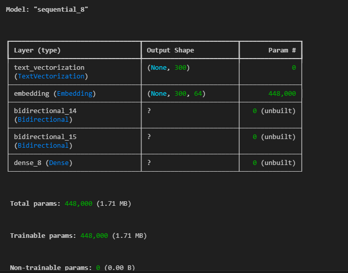
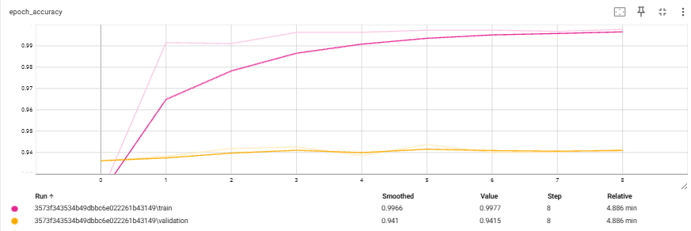
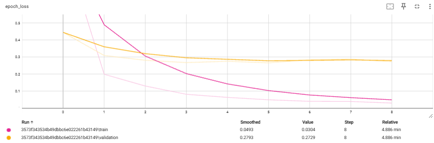
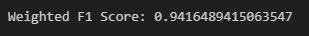
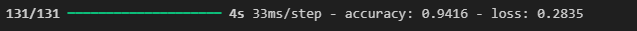

# **E-commerce Product Categorization using LSTM**
This project focuses on the categorization of e-commerce products into four predefined categories which are "Electronics", "Household", "Books", and "Clothing & Accessories". The goal is to use machine learning to automate the categorization process to save time and resources. The project uses a Long Short-Term Memory (LSTM) network to classify unseen product data with high accuracy.

## Project Overview
E-commerce platforms generate large volumes of textual data that hold valuable insights for businesses. Organizing products into distinct categories allows companies to improve efficiency and concentrate on specific product types. However, manual classification is a time-consuming task. This project seeks to automate the process using machine learning.

An LSTM model will be built to classify e-commerce products into one of the following four categories:

1. Electronics
2. Household
3. Books
4. Clothing & Accessories

The model will be trained using a dataset from Kaggle that consists of text descriptions of products, which will be used to train the LSTM model for categorization and assessed based on its accuracy and F1 score.

**Dataset URL**: [E-commerce Text Classification Dataset](https://www.kaggle.com/datasets/saurabhshahane/ecommerce-text-classification/data)

## Data Preparation
1. Download the dataset and read it using **Pandas** to preprocess and prepare the data for training.

## Data Training
1. Develop a deep learning model using **LSTM** (Long Short-Term Memory) to classify products into the specified categories.
2. Achieve an accuracy of more than **85%** and an **F1 score of more than 0.7**.
3. Use the **TensorFlow** library for developing and training the model.
4. Visualize the training process using **TensorBoard**.

## Model Architecture

## Data performance
1. The model's performance is evaluated using accuracy and F1 score metrics. The best-performing model is saved and used for predictions on the test dataset.
2. Save the trained model in **.keras** format in a folder named **model**.
3. Save the tokenizer in **.pkl** format in the **model** folder.

## Results

### Tensorboard Screenshot

A graph between the accuracy training vs validation score:

A graph between the loss training vs validation score:

The model f1 score:

The model accuracy score:

## Credit
https://www.kaggle.com/datasets/saurabhshahane/ecommerce-text-classification/data
